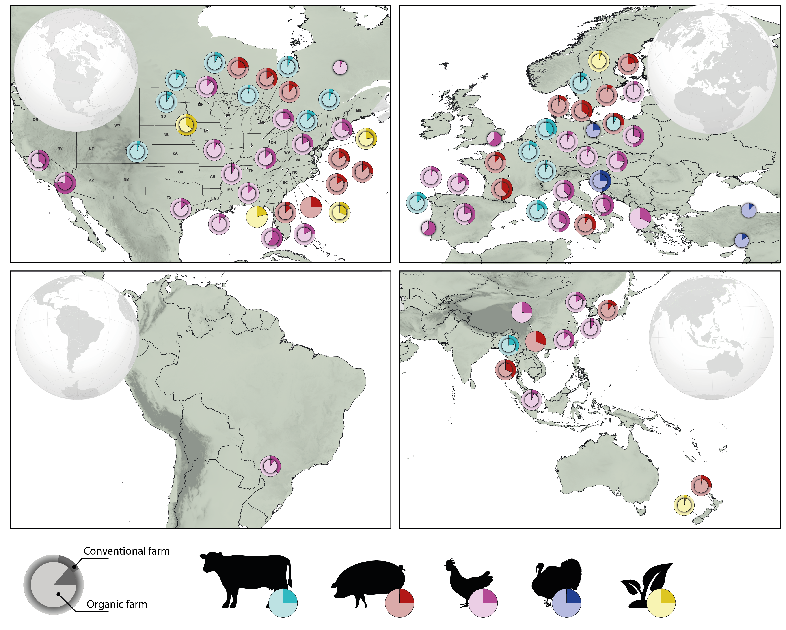

### Antimicrobial resistance (AMR) occurs when bacteria, viruses, fungi and parasites change over time and no longer respond to medicines making infections harder to treat and increasing the risk of disease spread, severe illness and death.

---

#### We investigate AMR prevalence of antimicrobials categorized by WHO as medically important in organic and conventional livestock production systems in North America, Asia, South America, Europe and Oceania. Our study covers isolotes from cattle, pigs, chicken, turkey and the environment and pathogens like *Campylobacter*, *Escherichia coli*, *Salmonella*, *Enterococcus* and *Staphylococcus aureus*.

This project is supervised by Dr Jessica Hite at The University of Wisconsin-Madison and Prof Eric Fevre at ILRI. 

Please visit [**Hite lab website**](https://evolutionaryepidemiology.org/) for more of our projects on antimicrobial resistance.

